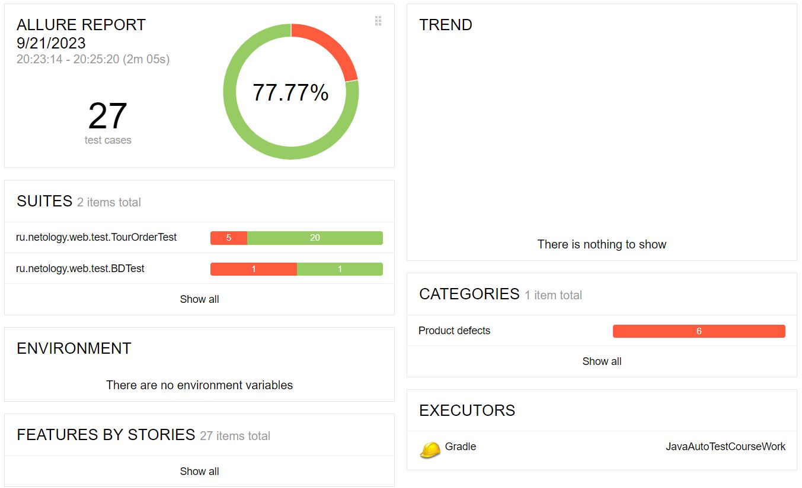
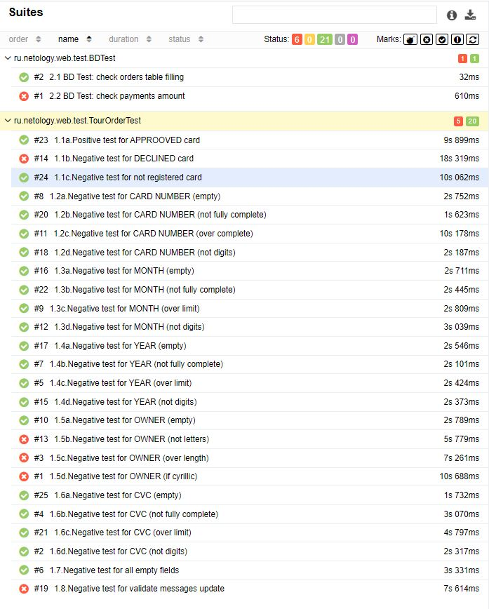

# Отчёт о проведённой автоматизации

В ходе автоматизации тестирования было запланировано покрыть автотестами все тестовые сценарии,
также, по возможности, автоматизировать проверку правильности заполнения базы данных при выполнении платежей во время прогона тестов.  
На всю работу по плану выделялось 10 дней.  
В итоге работы все тестовые сценарии автоматизированы,  
на проверку правильности заполнения базы данных пришлось выделить дополнительное время, помимо этого возникали сложности
в подборе селекторов веб-элементов вследствие недостатка опыта автоматизатора (сработавший риск).

В итоге, время потраченное на тестирование, превысило запланированное на 5 дней.

Отчет Allure:

